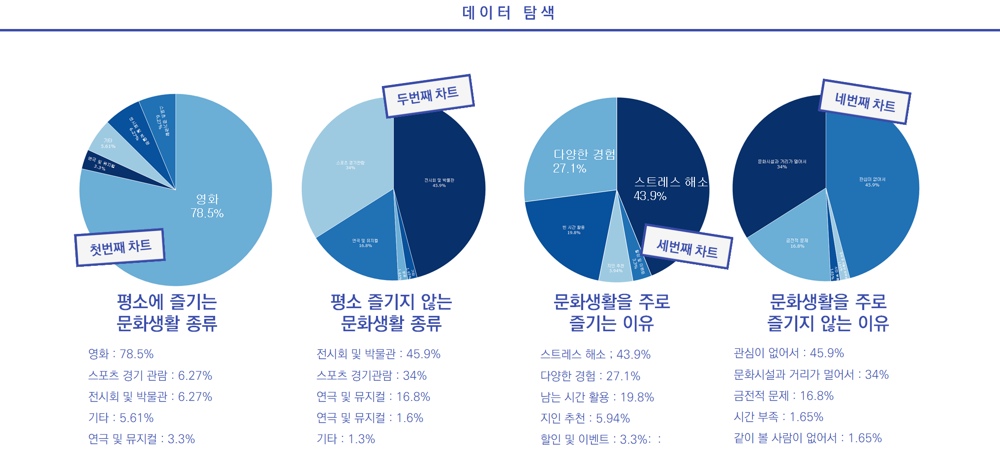
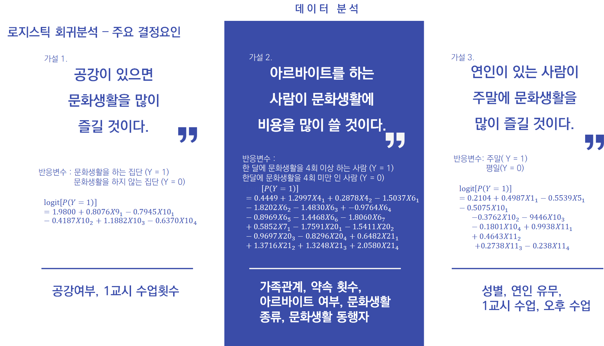

# 일상으로 보는 대학생의 문화생활
#### 팀장 : 박연아 팀원 : 김민영 외 32명
###### 자세한 설명 : 학술제 2조 최종.pdf 참고

## 주제 
#### 대학생들의 생활방식이 문화생활에 어떤 영향이 있는 지 파악한 후 분석 결과를 활용해 기업 입장에서 마케팅 전략을 세움.

## 언어 및 알고리즘
#### 언어 : R, SAS
#### 알고리즘 : Logistic Regression 

## 데이터 
### 설문조사
#### 모집단 : 전국에 있는 대학생
#### 표본 : OO대학교 학생
#### 조사기간 : 2017년 10월 30일 ~ 2017년 11월 2일 (총 4일)
#### 설문지 : 400장 
#### 회수된 설문지 : 390장

## 데이터 분석
### 데이터 탐색

### 데이터 분석
### 가설
#### 1. 공강이 있으면 문화생활을 많이 즐길 것이다.
#### 2. 아르바이트를 하는 사람이 문화생활에 비용을 많이 쓸 것이다.(또는 문화생활을 많이 즐길 것이다.)
#### 3. 연인이 있는 사람이 주말에 문화생활을 많이 즐길 것이다.

### 로지스틱 회귀분석

### 가설검증
### (1) 공강이 있으면 문화생활을 많이 즐길 것이다. (가설 채택)
### 주요 결정요인 : 공강 여부, 1교시 수업 횟수 
### (2) 아르바이트를 하는 사람이 문화생활에 비용을 많이 쓸 것이다. (가설 기각)
### 주요 결정요인 : 가족관계, 약속 횟수, 아르바이트 여부 등
### (3) 연인이 있는 사람이 주말에 문화생활을 즐길 것이다. (가설 기각)
### 주요 결정요인 : 성별, 연인 유무, 1교시 수업, 오후 수업 

## 결론
#### 대학생의 문화생활이 그들의 생활패턴과 서로 영향이 있다는 사실을 파악함.
#### 이를 이용해 문화행사 기획할 당시 대상을 연인들 행사 요이을 평일 위주로 진행한다면 문화생활 참여를 활성화 할 수 있음.

